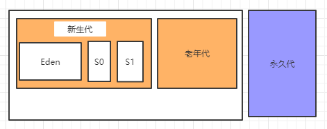
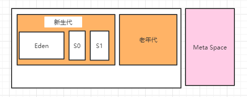

### 什么是 JVM

先来看下百度百科的解释：

> JVM 是 Java Virtual Machine（Java 虚拟机）的缩写，JVM 是一种用于计算设备的规范，它是**一个虚构出来的计算机**，是通过在实际的计算机上仿真模拟各种计算机功能来实现的。

晦涩难懂有没有，简单理解就是说虚拟机是物理机的软件实现。

Java 的设计理念是 WORA（Write Once Run Anywhere，一次编写到处运行）。编译器将 Java 文件编译为 Java .class 文件，然后将 .class 文件输入到 JVM 中，JVM 执行类文件的加载和执行，最后转变成机器可以识别的机器码进行最终的操作。

### 为什么要学习 JVM

每个 Java 开发人员都知道字节码经由 JRE（Java 运行时环境）执行。但他们或许不知道 JRE 其实是由 Java 虚拟机（JVM）实现，JVM 分析字节码，解释并执行它。作为开发人员，了解 JVM的 架构是非常重要的，因为它使我们能够编写出更高效的代码。

但是 JVM 在帮我们实现 Write Once Run Anywhere 的同时，有利有弊，因为在这个过程中涉及到了内存管理，尤其是多线程情况下的内存管理问题，所以我们更应该学习 JVM 的知识来帮助自己写出更好的代码。

根据上边对 JVM 的概念介绍我们知道，JVM 的主要作用在于以下两方面，之后我们的介绍也会以此着手。

- 软件层面的机器码翻译
- 内存管理

最近也在学习《深入理解 Java 虚拟机》这本书，此处贴个书中的图过来：

下边就详细介绍一下这张图中的各个组件

### 运行时数据区

这个区域描述的是 Java 代码运行时的状态，是我们非常关注的一个状态-程序运行状态，因为我们写代码就是为了运行，不运行的状态对我们是没什么吸引力的。说白了 Java 代码不外乎 **数据 指令 控制** 这三类型语句，所以我们将 JVM 运行时数据区可以划分为如下两大类：

- 数据
  - 方法区
  - 堆（Heap）
- 指令
  - 虚拟机栈
  - 本地方法栈
  - 程序计数器

#### 程序计数器

**定义**：指向**当前线程正在执行**的字节码指令的**地址** 也就是**行号**。

**注意**：我们需要思考一个问题，我的当前线程本身已经在执行了，为什么还要找个寄存器把他的执行行号记录下来呢？

因为我们程序执行的最小单位是线程，而线程在 CPU 上执行的时候是抢占式的，这样的话就存在线程被挂起的情况，例如：有 A B 两个线程，如果 A 线程执行过程被 B 线程抢占了 CPU，则需要把挂起的 A 线程 当前执行到的行号存储下来，等到 A 重新获得 CPU 时间片执行权的时候去程序计数器获得上一次执行的行号以便于继续执行这个程序。

所以，每个线程都有自己的 程序计数器，而且是互不干扰的，属于**线程私有区域**

- 如果执行的是一个 Java 方法，计数器记录的是正在执行的虚拟机字节码指令的地址
- 如果执行的是一个 Native 方法，计数器的值则为空（undefined）

#### 虚拟机栈

**定义**：存储当前线程运行方法所需要的数据、指令和返回地址，生命周期与线程相同，同样属于**线程私有区域**。

每个 Java 方法在执行的同时都会创建一个栈帧用于存储局部变量、操作数栈、方法出口等信息，

如下所示，这个栈帧会存储的信息包括：

- 局部变量表

- 操作数栈

- 动态链接

- 出口

- ... ...

  

每一个方法从调用直至执行完成的过程，其实真正对应的是一个栈帧在虚拟机栈中入栈到出栈的过程。

其中局部变量表存放了编译器可知的各种基本数据类型、引用对象等。需要注意的是因为局部变量表空间长度只有 32 位，如果是 long 和 double 类型的话会占用 2 个局部变量表空间，其他数据类型只占用 1 个。

**注意**：局部变量表所需的内存空间在编译期间就会车队分配完成，因为在进入一个方法时，这个方法需要在栈帧中分配多大的局部空间是完全确定的，方法运行期间局部变量大小是不会改变的。

### 本地方法栈

和虚拟机栈类似，只不过他存储的是当前线程调用的本地方法所需要的数据、指令和返回地址等，本地方法时标识有 Native 关键字的方法，此处就不展开描述了，参考上述虚拟机栈的介绍。

另外，根据《深入理解 Java 虚拟机》这本书的介绍，有些虚拟机（如 Sun HotSpot 虚拟机）直接就把本地方法栈和虚拟机栈合二为一了。

### 方法区

这块区域属于线程共享群与，主要存储的信息包括已被虚拟机你加载的类信息（类的元信息）、常量、静态变量、JIT（编译器编译后的代码）等数据。

方法区有一块区域我们称之为 **运行时常量池**，存放编译期生成的各种字面量和符号引用，运行时常量池有一个重要特征是具备动态性，也就是说在运行期间依然可以将新的常量放入池中，我们开发常用的有 String 类的 intern() 方法

### 堆（Heap）

属于线程共享区域，在虚拟机启动时创建，是虚拟机管理的内存中最大的一块。它的唯一作用就是存放对象实例。

根据虚拟机规范的描述是：所有的对象实例及数组都要在堆上分配。当然随着现在技术的发展优化这个也变得没有那么绝对，后续会进行分享。

这块区域也是垃圾收集器管理的主要区域，现如今流行的垃圾回收器基本都采用的是分代收集算法，所以也就衍生了一些分代方式，

比如对于内存模型的划分，在 JDK1.8 以前的版本基本是这样的：

* 新生代
  * Eden
  * s0
  * s1

* 老年代

* 永久代

在 JDK 1.8 以后的版本：

* 新生代

* 老年代

* Meta Space

此处小提一下，之所以在 JDK 1.8 以后 有了 Meta Space，其设计的目的在于规避永久代溢出的问题，因为 Meta Space 是可以自动扩容的，就跟 Java 中的集合一样。

以上种种的划分方式，都是为了更好地回收内存或者分配内存，从下一篇开始就开始学习内存分配及垃圾回收相关算法啦！

### 总结

* JVM 负责软件层面的机器码翻译，可以把我们写的 .java 文件翻译成机器可以识别的机器码
* JVM 负责内存管理
* JVM 的运行时数据区包括方法区、堆、虚拟机栈、本地方法栈和程序计数器
* JVM 中的方法区和堆区是所有线程共享的，其他区域都是线程独享的