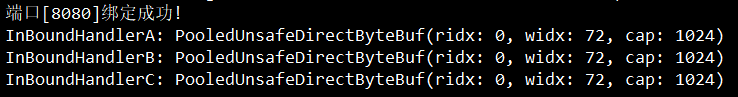
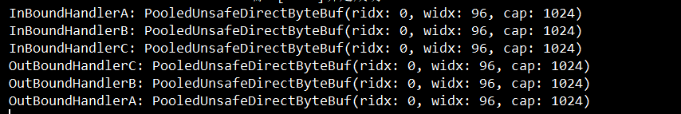
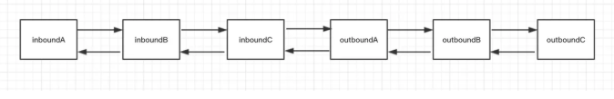
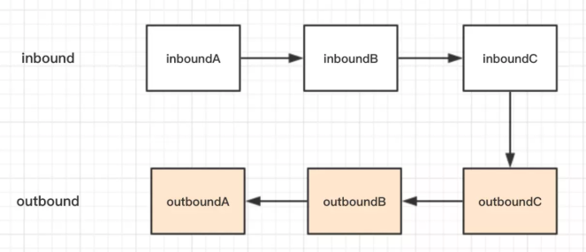

> 本系列文章参考内容为 闪电侠 的掘金小册
>
> 地址 ：[Netty入门与实战：仿写微信IM即时通信系统](https://juejin.im/book/5b4bc28bf265da0f60130116/section/5b6a1a9cf265da0f87595521)

通过上篇文章 [Netty从入门到实战（七）--- 实现客户端与服务端收发消息](https://blog.csdn.net/ZBylant/article/details/90754627) 我们会发现代码中充斥了大量的 `if else ` 代码块，哪如何避免 `else ` 泛滥 ？

我们先回忆一下客户端和服务端的数据处理流程：

* 数据传输
* 编码（decode）
* `if else ` `登录` `消息收发`
* 解码（encode）
* 数据传输

以上逻辑过程我们都是写到一个类中的，客户端对应 `ClientHandler.java`, 服务端对应 `ServerHandler.java`，这就造成一个问题：我们一旦要做功能扩展，哪就只能去这个类里面改改改，久而久之，这个类就变得杂乱不堪，十分臃肿！

此外，每次数据传输之前我们都需要手动调用 ByteBuf 对数据进行处理，以上场景我们可以使用模块化处理，不同的逻辑放置到单独的类来处理，最后将这些逻辑串联起来，形成一个完整的逻辑处理链。

基于此，我们今天要学习的 `pipeline` 和 `channelHandler` 正好是用来解决这个问题的：

> pipeline 和 channelHandler 通过责任链设计模式来组织代码逻辑，并且能够支持逻辑的动态添加和删除，Netty 能够支持各种协议的扩展，靠的就是 pipeline 和 channelHandler 。

### pipeline 与 channelHandler 的构成

在 Netty 中 ，一条连接对应一个 `Channel`，这条 `Channel` 所有的处理逻辑都在 `ChannelPipeline` 的对象里面，`ChannelPipeline` 是一个双向链表结构，它和 `Channel` 是一对一的关系。

`ChannelPipeline` 里面每一个节点都是一个 `ChannelHandlerContext` 对象，这个对象能拿到 `Channel` 相关的所有上下文信息。

### channelHandler 分类

* ChannelHandler
  * ChannelInBoundHandler
    * ChannelInBoundHandlerAdapter
  * ChannelOutBoundHandler
    * ChannelOutBoundHandlerAdapter

ChannelHandler 有两大子接口

* ChannelInBoundHandler 处理读数据的逻辑，也就是说在组装响应之前的逻辑，都可以放在 ChannelInBoundHandler 中处理，最重要的方法就是 `channelRead()`方法；
* ChannelOutBoundHandler 处理写数据的逻辑，最核心的一个方法是 `write()`。

这两个子接口有两个默认实现 `ChannelInBoundHandlerAdapter` 和 `ChannelOutBoundHandlerAdapter`，默认情况下会把读写事件传播到下一个 handler。

### ChannelInboundHandler 的事件传播

在服务端的 pipeline 添加三个处理器, 添加的顺序为 `A -> B -> C`

> NettyServer.java

```java
serverBootstrap.group(bossGroup,workerGroup)
                .channel(NioServerSocketChannel.class)
                .childHandler(new ChannelInitializer<NioSocketChannel>() {
                    @Override
                    protected void initChannel(NioSocketChannel ch) throws Exception {
                        ch.pipeline().addLast(new InBoundHandlerA());
                        ch.pipeline().addLast(new InBoundHandlerB());
                        ch.pipeline().addLast(new InBoundHandlerC());
                    }
                });
```

> InBoundHandlerA.java

```java
public class InBoundHandlerA extends ChannelInboundHandlerAdapter {
    @Override
    public void channelRead(ChannelHandlerContext ctx, Object msg) throws Exception {
        System.out.println("InBoundHandlerA: " + msg);
        super.channelRead(ctx, msg);
    }
}
```

> InBoundHandlerB.java

```java
public class InBoundHandlerB extends ChannelInboundHandlerAdapter {
    @Override
    public void channelRead(ChannelHandlerContext ctx, Object msg) throws Exception {
        System.out.println("InBoundHandlerB: " + msg);
        super.channelRead(ctx, msg);
    }
}
```

> InBoundHandlerC.java

```java
public class InBoundHandlerC extends ChannelInboundHandlerAdapter {
    @Override
    public void channelRead(ChannelHandlerContext ctx, Object msg) throws Exception {
        System.out.println("InBoundHandlerC: " + msg);
        super.channelRead(ctx, msg);
    }
}
```

> 执行结果 

可以发现输出的结果和添加顺序一致，是 `A -> B -> C`



我为什么会在此处强调事件传播性的顺序，想必大家自己也想过，哪么，此时的你就应该先停下来，然后撸一段代码，证明一下 `ChannelOutBoundHandler`的事件传播是什么样的？

-----------------------------我是一条分割线-----------------------------

### channelOutBoundHandler 的事件传播

和上述操作过程差不多，开始撸代码！

> NettyServer.java

```java
serverBootstrap
                .group(boosGroup, workerGroup)
                .channel(NioServerSocketChannel.class)
                .childHandler(new ChannelInitializer<NioSocketChannel>() {
                    protected void initChannel(NioSocketChannel ch) {
                        // inBound，处理读数据的逻辑链
                        ch.pipeline().addLast(new InBoundHandlerA());
                        ch.pipeline().addLast(new InBoundHandlerB());
                        ch.pipeline().addLast(new InBoundHandlerC());

                        // outBound，处理写数据的逻辑链
                        ch.pipeline().addLast(new OutBoundHandlerA());
                        ch.pipeline().addLast(new OutBoundHandlerB());
                        ch.pipeline().addLast(new OutBoundHandlerC());
                    }
                });
```

> OutBoundHandlerA.java
```java
public class OutBoundHandlerA extends ChannelOutboundHandlerAdapter {

    @Override
    public void write(ChannelHandlerContext ctx, Object msg, ChannelPromise promise) throws Exception {
        System.out.println("OutBoundHandlerA: " + msg);
        super.write(ctx, msg, promise);
    }
}

```
> OutBoundHandlerB.java
```java
public class OutBoundHandlerB extends ChannelOutboundHandlerAdapter {

    @Override
    public void write(ChannelHandlerContext ctx, Object msg, ChannelPromise promise) throws Exception {
        System.out.println("OutBoundHandlerA: " + msg);
        super.write(ctx, msg, promise);
    }
}
```
> OutBoundHandlerC.java
```java
public class OutBoundHandlerC extends ChannelOutboundHandlerAdapter {

    @Override
    public void write(ChannelHandlerContext ctx, Object msg, ChannelPromise promise) throws Exception {
        System.out.println("OutBoundHandlerC: " + msg);
        super.write(ctx, msg, promise);
    }
}
```

> 执行结果



可以发现输出的结果和添加顺序正好相反，是 `C -> B -> A`

由此可以判断出 pipeline 的结构是类似双向链表的，如下如所示：

#### pipeline 的结构



#### pipeline 的执行顺序



也就是说虽然读数据和写数据的 handler 都是在同一个双向链表中，但是因为他们的分工不一样，inBoundHandler 的事件只会传播到下一个 inBoundHandler,outBoundHandler 的事件也只会传播到下一个 outBoundHandler, 两者之间是不受干扰的。

### 总结

* channelHandler 分为 inBound 和 outBound 两种类型的接口，分别负责读数据和写数据的处理逻辑；
* ChannelInboundHandlerAdapter 和 ChannelOutboundHandlerAdapter 是对应接口的默认实现，默认会把事件传递到下一个 handler 继续处理；
* inBoundHandler 的执行顺序与我们实际的添加顺序相同，而 outBoundHandler 则相反。

