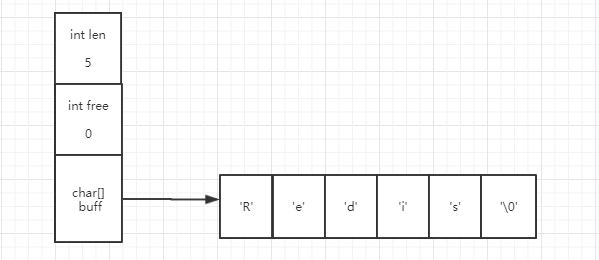
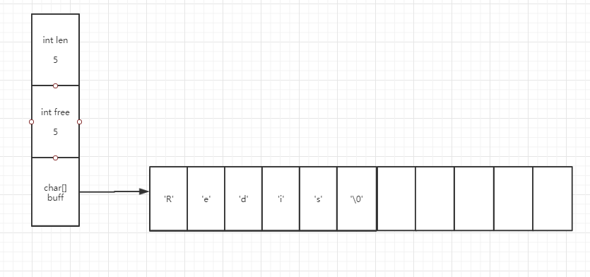
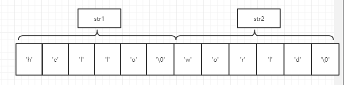
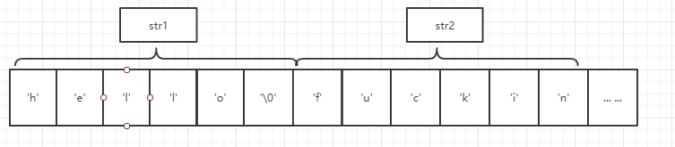
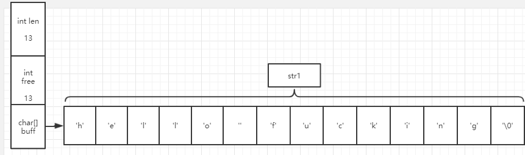

## Redis 深度历险

## Redis 可以做什么

* 缓存用户行为历史，过滤恶意行为（zset,hash）
* 记录帖子的点赞数、评论数和点击数(hash)
* 缓存近期热帖内容，减少数据库压力（hash）
* 记录帖子的标题、摘要、作者和封面信息，用于列表页展示（hash）

... ...

## Redis 基础数据结构

### 基本数据结构

* string
* list
* set
* hash
* zset

#### 字符串

动态字符串，可以修改，内部结构类似 Java 的 ArrayList,采用预分配冗余空间的方式来减少内存的频分分配；

支持的字符串最大长度 512MB,长度不足 1MB，每次扩容一倍，超过 1MB，每次扩容 1MB；

读写键值对可以使用批量的方式来减少网络开销 `mset` `mget`；

设置过期时间 setex (set + expire) ；

value 是一个整数的话还可以进行自增操作，自增范围是 signed long 的最大和最小值之间；

##### 底层实现

Redis 并没有采用 C 语言的字符串来表示 string 数据类型，而是自己构建了一种 【简单动态字符串】 的抽象类型，英文表示为 simple dynamic string ,简称为 SDS ，【SDS 是 Redis 的默认字符串表示】。

除此之外，SDS 还被用做 AOF 模块中的 AOF 缓冲区，以及客户端状态的输入缓冲区，这个期待后文我们会依次介绍。

###### SDS 的结构

```C
// sds.h
struct sdshdr { 
    // 记录 buf 数组中已使用字节的数量 
    // 等于 SDS 所保存字符串的长度 
    int len; 
    // 记录 buf 数组中未使用字节的数量 
    int free; 
    // 字节数组， 用于保存字符串 
    char buf[]; 
};
// 黄健宏. Redis设计与实现 (数据库技术丛书) (Kindle 位置 391-394). 机械工业出版社. Kindle 版本. 
```

SDS 遵循 C 语言中的字符串以空字符结尾的惯例，并且保存空字符的这个一个字节空间不计入 SDS 的 len 属性。

SDS 在具体分配过程中会有两种分配方式：

以我们现在要存入的字符串 Redis 为例，会有以下两种情况

* 未冗余分配空间

  恰好分配了足够存储 Redis 这个字符串的空间，没有任何冗余。此时 len = 5,代表了存储字符串的具体长度，free = 0 ，代表在存储完字符串之后没有任何可以使用的空间了，buf 数组存储了具体的字符串内容。

  

* 冗余分配空间

  使用了冗余分配空间方式之后，此时 len 的值还是 5，但是 free 的值不再是 0，而是 5，代表还有 5 个未使用空间可用。

  

###### 为什么 Redis 不直接采用 C 字符串的方式来表示 string ?

我们知道 C 语言是使用了长度为 N+1 的字符数组来表示长度为 N 的字符串的，并且字符数组的最后一个元素一定是空字符 '\0', 用来标识字符串的结束。但是这种简单的字符串表示方式并不能满足 Redis 对于字符串安全性、效率以及功能方面的要求，具体原因如下：

* 获取字符串长度的复杂性

  使用 C 字符串的话由于它没有记录自身实际存储的字符串长度信息，所以为了获取一个 C 字符串的长度信息，需要遍历整个字符串，进而统计字符个数，直到遇到空字符，复杂度为 O（N）;

  但是不同的是，Redis 自定义的 SDS 结构单独记录了字符串的实际长度，也就是属性 len，这样一来在获取字符串长度的时候复杂度瞬间会降低到 O（1）；

  另外还有一点，整个过程中设置和更新 SDS len 值的工作时由 SDS 的 API 在执行时自动完成的，无须任何手动修改长度的工作。

* 杜绝了缓冲区溢出

  由于 C 字符串不记录自身长度，从而还带来一个容易造成缓冲区溢出的问题，假设有两个 C 字符串 str1 和 str2，其中 str1 = "hello"，str2 = "world"，如下图：

  

  现在我们使用 `strcat(str1,"fucking")`来修改 str1 的内容，但是我们并没有重新为 str1 分配足够的空间，哪么 str1 的空间将会产生溢出到 str2 的空间中，从而意外的把 str2 的内容修改了，变成如下图：

  

  但是 SDS 不同，SDS 的分配策略可以杜绝发生缓冲区溢出的可能性，当 SDS API 对 SDS 进行修改时，API 会首先检查 SDS 的空间是否满足修改所需要求，如果不满足则会修改 SDS 大小，然后再执行实际的修改操作，如下图：

  

  可以看到，SDS 不但扩容了 SDS 原本的空间，而且还冗余分配了 13 个空间，这和它的分配策略相关，今天先不谈这个，等待后文介绍。

* 减少修改字符串时带来的内存重分配次数

  由于 C 字符串的长度和底层数组的长度之间存在关联性，所以每次修改字符串的时候，都需要对这个底层数组进行一次内存重分配的操作：

  * 如果是字符串长度增加，则需要扩展底层数组空间，反之如果不扩展，则产生内存溢出；
  * 如果是字符串长度减少，则需要释放底层数组空间，反之如果不释放，则产生内存泄漏；

  而 Redis 是一个高性能的数据库，如果每次都需要重新分配内存空间的话，会对性能造成严重的影响。所以 SDS 通过空间冗余分配这种方式解除了字符串长度和底层数组长度之间的关联，从而避免了每次都进行内存重分配，主要分配优化策略有两种：

  1. 空间预分配

     空间预分配用于优化字符串增加操作，在对 SDS 空间进行扩展的时候，程序不仅为 SDS 分配修改所需要的扩建，还会分配额外的未使用空间备用。

     额外空间的分配遵循以下原则：

     * SDS 修改之后的长度也就是 len 值小于 1MB 时，程序将分配和 len 属性相同大小的未使用空间，即就是说，len = free;
     * SDS 修改之后的长度大于 1MB，程序会直接额外分配 1MB 的未使用空间；

     使用以上策略，Redis 就可以减少连续执行字符串增长操作所需的内存重分配次数。

  2. 惰性空间释放

     惰性空间释放用于优化 SDS 的字符串缩短操作，SDS 在需要缩短字符串时，程序会使用 free 属性将字符串缩短后多出来的字节记录起来，并等待将来使用而不是立即使用内存重分配来回收这些字节。这样做的一个好处就是一旦我们以后需要对这个 SDS 进行增长操作的话，这些未使用空间将有很大的可能性直接派上用场。

* 二进制安全

  C 字符串对于字符有一些特定要求：

  * 字符必须符合某种编码；
  * 除了字符串末尾之外，不能包含空字符；

  这样一来就使得 C 字符串只能用来保存一些文本数据，而无法保存一些类似图片、视频的二进制数据。但是 SDS 的 API 都会以二进制的方式来处理 SDS 存放在 buf 数组里的数据，同时使用了 len 属性值来判断字符串是否结束，从而保证了 Redis 可以作用于更多的场景。

#### 链表

> 链表提供高效的节点重排能力，以及顺序性的节点访问方式，并且可以通过增删节点来灵活的调整链表的长度。

##### TODO 链表基本介绍

##### Redis 中的链表实现

Redis 中的链表节点使用一个 listNode 结构来表示：

```C 
typedef struct listNode { 
    // 前置节点 
    struct listNode * prev; 
    // 后置节点 
    struct listNode * next; 
    // 节点的值 
    void * value; 
}listNode;
// 黄健宏. Redis设计与实现 (数据库技术丛书) (Kindle 位置 596-599). 机械工业出版社. Kindle 版本. 
```

多个 listNode 通过 prev 和 next 两个指针组成了双端链表。listNode 是实现 list 结构的基础，在 list 结构中，包含头指针 head，尾指针 tail，以及链表长度计数器 len，除了这几个属性之外，我们看到还有几个函数，这几个函数的作用是：

* dup : 复制链表节点所保存的值；
* free ：释放链表节点锁保存的值；
* match ：对比链表节点所保存的值和另一个输入值是否相等；

```C
typedef struct list { 
    // 表头节点
	listNode * head; 
    // 表尾节点 
    listNode * tail; 
    // 链表所包含的节点数量 
    unsigned long len; 
    // 节点值复制函数 
    void *(*dup)( void *ptr); 
    // 节点值释放函数 
    void (*free)( void *ptr); 
    // 节点值对比函数 
    int (*match)( void *ptr, void *key); 
} list;
// 黄健宏. Redis设计与实现 (数据库技术丛书) (Kindle 位置 603-604). 机械工业出版社. Kindle 版本. 
```

###### 小结

Redis 的链表特性可以总结如下：

* 双向链表：带有 prev 和 next 指针，获取某个节点前置和后置节点的复杂度都是 O(1)；
* 带头指针和尾指针：通过 list 结构的 head 指针和 tail 指针，获取链表的表头节点和表尾节点的复杂度都是 O(1);
* 链表长度计数器：使用 list 结构的 len 属性来对 list 所持有的的链表节点进行计数，获取链表中节点数量复杂度为 O(1);
* 链表被广泛用于实现 Redis 的各种实现功能，如发布/订阅、慢查询、监视器等等；
* 链表表头节点的前置节点和表尾节点的后置节点都是 NULL，所以 Redis 的链表是无环链表，对它的遍历以碰到 NULL 为止；
* 通过为链表设置不同的类型特定函数（dup,free,match），进而使得 Redis 的链表可以用于保存不同类型的值。

#### 字典

> 字典， 又称为符号表（ symbol table）、 关联数组（ associative array） 或映射（ map）， 是一种 用于保存键值 对（ key- value pair） 的抽象数据结构。

Redis 的字典使用了哈希表作为底层实现，一个哈希表里面可以有很多个哈希表节点，而每个哈希表节点保存了字典中的一个键值对。

###### 哈希表

```C
typedef struct dictht { 
    // 哈希表数组 
    dictEntry **table; 
    // 哈希表大小 
    unsigned long size; 
    // 哈希表大小掩码， 用于计算索引值 
    // 总是等于 size- 1 
    unsigned long sizemask; 
    // 该哈希表已有节点的数量 
    unsigned long used; 
} dictht;
// 黄健宏. Redis设计与实现 (数据库技术丛书) (Kindle 位置 664-668). 机械工业出版社. Kindle 版本. 
```

1. table 属性是一个数组，数组中的每一个元素都是一个指向 dicthtEntry 结构的指针，每个 ditchtEntry 结构保存着一个键值对；

2. size 属性记录了哈希表的大小，也就是 table 数组的大小；

3. used 属性记录了目前哈希表已有键值对的数量；

4. sizemask 属性的值总是等于 size -1 ,该属性和哈希值一起决定一个键应该被放到 table 数组的哪个索引上面。

**哈希表节点**

哈希表的每个节点都是用 dicthtEntry 结构来表示的，每个 ditchtEntry 结构都保存着一个键值对：

```C
typedef struct dictEntry { 
    // 键 
    void *key; 
    // 值 
    union{ 
        void *val; 
        uint64_ tu64; 
        int64_ ts64; 
    } v; // 指向下个哈希表节点，形成链表 
    struct dictEntry *next; 
} dictEntry;
// 黄健宏. Redis设计与实现 (数据库技术丛书) (Kindle 位置 676-679). 机械工业出版社. Kindle 版本. 
```

根据上述代码可得：v 属性代表了键值对的值，这个值可以是一个指针，也可以是一个 uint64_ t  整数或者 uint64_t  整数。

next 指针指向了另一个哈希表节点，这样可以把多个哈希值相同的键值对去连接在一起，以此解决键冲突的问题（有些类似于 Java 中 HashMap 的处理方式，采用拉链法来解决哈希冲突）；

###### 字典

Redis 中的字典结构如下：

```C
typedef struct dict { 
    // 类型特定函数 
    dictType *type; 
    // 私有数据 
    void *privdata; 
    // 哈希表 
    dictht ht[2]; 
    // rehash 索引 
    // 当 rehash 不在进行时， 值为 -1 
    int rehashidx; 
    /* rehashing not in progress if rehashidx == -1 */ 
} dict;
// 黄健宏. Redis设计与实现 (数据库技术丛书) (Kindle 位置 687-691). 机械工业出版社. Kindle 版本. 
```

type 属性和 privdata 属性是针对不同类型的键值对，为了创建多态字典而设置的，其中 type 属性是一个指向 dictType 结构的指针，每个 dictType 结构保存了用于操作特定类型键值对的函数，而 privdata 属性则是保存了需要传给那些类型特定函数的可选参数；

ht 属性是一个包含两个项的数组，数组中的每一项都是 dictth 哈希表，一般情况下，字典只使用 ht[0] 哈希表，ht[1] 只会在 ht[0] rehash 时使用；

rehashidx 记录了 rehash 目前的进度，如果目前没有 rehash,则 rehashidx 的值为 -1；

TODO 补充结构图

###### 哈希算法

Redis 计算哈希值和索引值的方法如下：

```C
# 使用字典设置的哈希函数，计算键 key 的哈希值 
hash = dict-> type-> hashFunction( key); 
# 使用哈希表的 sizemask 属性和哈希值，计算出索引值 
# 根据情况不同，ht[x] 可以是 ht[0] 或者 ht[1] 
index = hash & dict-> ht[ x]. sizemask;
// 黄健宏. Redis设计与实现 (数据库技术丛书) (Kindle 位置 710-712). 机械工业出版社. Kindle 版本. 
```

###### 解决哈希冲突

使用链地址法，因为每一个哈希表节点都有一个指针 next ,被分配到同一个索引上的多个节点可以用这个指针连接起来构成单链表，这里有一点需要注意的是因为 dictEntry 节点组成的链表没有指向链表表尾的指针，所以为了速度考虑，程序总是将新节点添加到链表的表头位置，这样的话复杂度是 O(1), 效率比较高。

###### rehash

> 随着操作的不断执行， 哈希表保存的键值对会逐渐地增多或者减少，为了让哈希表的负载因子（ load factor） 维持在 一个合理的范围之内， 当哈希表保存的键值对数量太多或者太少时， 程序需要对哈希表的大小进行相应的扩展或者收缩。
>
> 
>
> 黄健宏. Redis设计与实现 (数据库技术丛书) (Kindle 位置 739-741). 机械工业出版社. Kindle 版本. 

rehash 的步骤如下：

TODO rehash 渐进式 rehash


#### 跳跃表

跳跃表是一种有序数据结构（skiplist）,它通过在每个节点中维持多个指向其他节点的指针，从而达到快速访问节点的目的。

跳跃表节点查询时：

* 最坏时间复杂度 O(N)
* 平均时间复杂度 O(logN)

也就是说，在 N 达到一定程度之后，平均复杂度趋向于 0，从而大部分情况下跳跃表的效率可以和平衡树相媲美，并且跳跃表的实现比平衡树要更为简单。

###### 跳跃表的实现

Redis 的跳跃表由 zskiplistNode 和 zskiplist 两个结构定义：

* zskiplistNode：表示跳跃节点；
* zskiplist：保存跳跃节点的相关信息，比如节点数量，以及表头节点和表尾节点指针等；