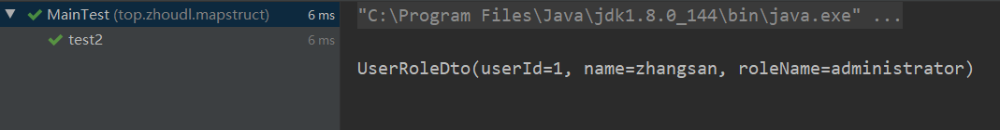

### 简介

在业务项目的开发中，我们经常需要将 Java 对象进行转换，比如从将外部微服务得到的对象转换为本域的业务对象 `domain object`，将 `domain object` 转为数据持久层的 `data object`，将 `domain object` 转换为 `DTO` 以便返回给外部调用方等。在转换时大部分属性都是相同的，只有少部分的不同，如果手工编写转换代码，会很繁琐。这时我们可以通过一些对象转换框架来更方便的做这件事情。

这样的对象转换框架有不少，比较有名的有 ModelMapper 和 MapStruct。它们所使用的实现技术不同，ModelMapper 是基于反射的，通过反射来查找实体对象的字段，并读取或写入值，这样的方式实现原理简单，但性能很差。与 ModelMapper 框架不同的是，MapStruct 是基于编译阶段代码生成的，生成的转换代码在运行的时候跟一般的代码一样，没有额外的性能损失。本文重点介绍 MapStruct。

### 业务场景

假设现在有这么个场景，从数据库查询出来了一个 user 对象（包含 id，用户名，密码，手机号，邮箱，角色这些字段）和一个对应的角色对象 role（包含 id，角色名，角色描述这些字段），现在在 `controller` 需要用到 user 对象的 id，用户名，和角色对象的角色名三个属性。一种方式是直接把两个对象传递到 `controller` 层，但是这样会多出很多没用的属性。更通用的方式是需要用到的属性封装成一个类(DTO)，通过传输这个类的实例来完成数据传输。

#### 实现方式之使用传统方式

如下：

> User.java

```java
@AllArgsConstructor
@Data
public class User {
    private Long id;
    private String username;
    private String password;
    private String phoneNum;
    private String email;
    private Role role;
}
```

> Role.java

```java
@AllArgsConstructor
@Data
public class Role {
    private Long id;
    private String roleName;
    private String description;
}
```

> UserRoleDto.java

```java
@Data
public class UserRoleDto {
    /**
     * 用户id
     */
    private Long userId;
    /**
     * 用户名
     */
    private String name;
    /**
     * 角色名
     */
    private String roleName;
}
```

> MainTest.java
>
> 测试类，模拟将 user 对象转换成 UserRoleDto 对象

```java
public class MainTest {

    User user = null;

    /**
     * 模拟从数据库中查出 user 对象
     */
    @Before
    public void before() {
        Role role  = new Role(2L, "administrator", "超级管理员");
        user  = new User(1L, "zhangsan", "12345", "17677778888", "123@qq.com", role);
    }

    /**
     * 模拟把 user 对象转换成 UserRoleDto 对象
     */
    @Test
    public void test1() {
        UserRoleDto userRoleDto = new UserRoleDto();
        userRoleDto.setUserId(user.getId());
        userRoleDto.setName(user.getUsername());
        userRoleDto.setRoleName(user.getRole().getRoleName());
        System.out.println(userRoleDto);
    }
}
```

运行结果



上边的代码或许暂时看起来还是比较简洁的，但是我们需要注意的一点就是平时业务开发中的对象属性远不是上述代码中简简单单的几个字段，有可能会有数十个字段，同理也会数十个对象需要转换，我们如果还是通过 getter、setter 的方式把一个对象属性值复制到另一个对象中去还是非常麻烦的，不过不用担心，今天要介绍给大家的 MapStruct 就是用于解决这种问题的。

#### 实现方式之使用 MapStruct 

这里我们沿用上述代码中的基本对象 `User.java`、`Role.java`、`UserRoleDto.java`。
然后新建一个 `UserRoleMapper.java`，这个来用来定义 `User.java`、`Role.java`和`UserRoleDto.java`之间属性对应规则。

在这之前我们需要引入 MapStruct 的 pom 引用：

```xml
 <dependency>
      <groupId>org.mapstruct</groupId>
      <artifactId>mapstruct-jdk8</artifactId>
      <version>1.3.0.Final</version>
</dependency>
```

> UserRoleMapper.java

```java
import org.mapstruct.Mapper;
import org.mapstruct.Mapping;
import org.mapstruct.Mappings;
import org.mapstruct.factory.Mappers;

/**
 * @Mapper 定义这是一个MapStruct对象属性转换接口，在这个类里面规定转换规则
 *         在项目构建时，会自动生成改接口的实现类，这个实现类将实现对象属性值复制
 */
@Mapper
public interface UserRoleMapper {

    /**
     * 获取该类自动生成的实现类的实例
     * 接口中的属性都是 public static final 的 
     * 方法都是public abstract 的
     */
    UserRoleMapper INSTANCES = Mappers.getMapper(UserRoleMapper.class);

    /**
     * 这个方法就是用于实现对象属性复制的方法
     *
     * @Mapping 用来定义属性复制规则 
     *              source 指定源对象属性 
     *              target 指定目标对象属性
     *
     * @param user 这个参数就是源对象，也就是需要被复制的对象
     * @return 返回的是目标对象，就是最终的结果对象
     */
    @Mappings({
            @Mapping(source = "id", target = "userId"),
            @Mapping(source = "username", target = "name"),
            @Mapping(source = "role.roleName", target = "roleName")
    })
    UserRoleDto toUserRoleDto(User user);

}
```

测试一下结果

> MainTest.java

```java
/**
     * 模拟通过MapStruct把user对象转换成UserRoleDto对象
     */
    @Test
    public void test2() {
        UserRoleDto userRoleDto = UserRoleMapper.INSTANCES.toUserRoleDto(user);
        System.out.println(userRoleDto);
    }
```

呃，很明显，运行竟然报错了，具体异常如下：


核心是这一句 ：`java.lang.ClassNotFoundException: Cannot find implementation for top.zhoudl.mapstruct.UserRoleMapper` ,也就是说没有找到 UserRoleMapper 类的实现类。

通过查阅一些资料可得：

> MapStruct 是一个可以处理注解的Java编译器插件，可以在命令行中使用，也可以在 IDE 中使用。MapStruc t有一些默认配置，但是也为用户提供了自己进行配置的途径。缺点就是这玩意在使用工具自带的编译器时不会生成实现类，需要通过 maven 的方式来进行编译，然后才会生成实现类。

所以我们需要增加一个编译插件到 pom 文件中：

```xml
<!-- 引入 processor -->
<dependency>
      <groupId>org.mapstruct</groupId>
      <artifactId>mapstruct-processor</artifactId>
      <version>1.3.0.Final</version>
      <scope>provided</scope>
</dependency>
<!--为 Maven compile plugin 设置 annotation processor -->
<plugins>
	<plugin>
          <groupId>org.apache.maven.plugins</groupId>
          <artifactId>maven-compiler-plugin</artifactId>
          <version>3.5.1</version>
          <configuration>
            <source>1.8</source>
            <target>1.8</target>
            <annotationProcessorPaths>
              <path>
                <groupId>org.mapstruct</groupId>
                <artifactId>mapstruct-processor</artifactId>
                <version>1.2.0.Final</version>
              </path>
            </annotationProcessorPaths>
          </configuration>
	</plugin>
</plugins>
```

然后我们运行程序就可以得到自己想要的结果了


#### 安装 MapStruct 插件

使用 MapStruct，还有一个缺点就是，当属性改名的时候，因为在 Mapper 上注解中配置的名字是在字符串里面，因此不会自动同步的。所以 MapStruct 提供了一个插件来解决这个问题，同时还提供代码自动提示、点击跳转到实现等功能。

关于插件的更多信息，参见 [MapStruct support for IntelliJ IDEA](https://yq.aliyun.com/go/articleRenderRedirect?url=http%3A%2F%2Fmapstruct.org%2Fnews%2F2017-09-19-announcing-mapstruct-idea%2F)

##### 安装插件的过程

在 IDEA 中依次打开 File - > Settings - > Plugins 

然后在 Markeyplace 搜索框中输入 mapstruct，点击 install，然后重启 IDE 即可。


#### 一些可能会出现的问题

- 找不到注释处理程序：在 pom.xml 中增加 mapstruct-processor 的依赖

- 没有找到实现类：在 pom.xml 中加入对 mapstruct-processor 的依赖

- 在 IDEA 里面 enable Annotation Processor

- 使用 Lombok 的情况下，编译时报 Data 类的 setter/getter 找不到：把 lombok 加入到annotationProcessorPath，如下图 

  

### 总结

`MapSturct` 是一个生成类型安全， 高性能且无依赖的 JavaBean 映射代码的注解处理器（annotation processor）。

作为一个注解处理器， 通过`MapStruct` 生成的代码具有怎么样的优势呢？抓一下重点：

1. 注解处理器
2. 可以生成 `JavaBean` 之间的映射代码
3. 类型安全， 高性能， 无依赖性

#### 高性能

这是相对反射来说的， 反射需要去读取字节码的内容， 花销会比较大。 而通过 `MapStruct` 来生成的代码， 其类似于人手写，代码执行速度上可以得到保证。（前面例子中生成的代码可以在编译后看到，在项目的 `target/generated-sources/annotations` 目录里可以看到具体代码）。

#### 易于 debug

在我们生成的代码中， 我们可以轻易的进行 debug。但是如果是使用反射实现代码的时候， 一旦出现了问题， 很多时候是比较难找到原因。

#### 使用相对简单

如果是完全映射的， 使用起来肯定没有反射简单。 用类似 `BeanUtils` 这些工具一条语句就搞定了。 但是，如果需要进行特殊的匹配（特殊类型转换， 多对一转换等）， MapStruct 的优势就比较明显了，基本上我们只需要在使用的时候声明一个接口， 接口下写对应的方法， 就可以使用了（当然， 如果有特殊情况， 是需要额处理一下的）。

#### 代码独立

生成的代码是对立的， 没有运行时的依赖


--------------------------
本文首发于微信公众号 【程序猿杂货铺】，关注公众号，获取更多精彩文章！

