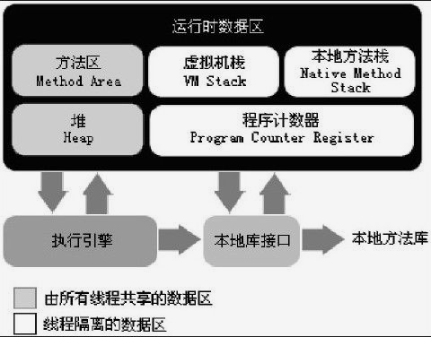

# 深入理解 Java 虚拟机读书笔记

## 第二章  Java 内存区域与内存溢出异常

### 运行时数据区

#### 程序计数器

当前线程所执行的字节码的 **行号指示器**

每条线程都需要有一个独立的 程序计数器，各条线程之间计数器互不影响，属于**线程私有区域**

* 如果执行的是一个 Java 方法，计数器记录的是正在执行的虚拟机字节码指令的地址

* 如果执行的是一个 Native 方法，计数器的值则为空（undefined）

#### Java 虚拟机栈

也是属于**线程私有区域**，生命周期与线程相同。

每个 Java 方法在执行的同时都会创建一个栈帧用于存储局部变量、操作数栈、方法出口等信息，每一个方法从调用直至执行完成的过程，就对应着一个栈帧在虚拟机栈中入栈到出栈的过程。

局部变量表所需的内存空间在编译期间完成分配，当进入一个方法时，这个方法需要在帧中分配多大的局部变量空间是完全确定的，在方法运行期间不会改变局部变量表的大小。

该区域有两种异常情况

* `StackOverflowError` ：线程请求的栈深度大于虚拟机所允许的深度 
* `OutOfMemoryError` ：虚拟机在自动扩展的时候请求不到足够的内存

#### 本地方法栈

与虚拟机栈发挥的作用类似，但是两者服务对象不同，本地方法栈为虚拟机使用到的 Native 方法服务，虚拟机栈为虚拟机执行的 Java 方法服务。

备注：有的虚拟机实现可以把二者合二为一

与虚拟机栈一样，该区域也存在两种异常情况，同上。

#### Java 堆

Heap 是 虚拟机所管理内存中最大的一块，此区域是被所有线程共享的一块内存区域，在虚拟机启动时创建。

此区域的唯一目的就是 **存放对象实例**，几乎所有的对象都在这里分配内存。

#### 方法区

此区域是线程共享的，用于存储已被虚拟机加载的类信息、常量、静态变量等代码数据。

当方法区无法满足内存分配需求时，抛出 `OutOfMemoryError`异常。

##### 运行时常量池

方法区的一部分

### HotSpot 虚拟机对象探秘

#### 对象的创建

* 指针碰撞

* 空闲列表

#### 对象的内存布局

对象在内存中存储的布局可以分为 3 块区域：**对象头、实例数据和对齐填充**

## 第三章 垃圾收集器与内存分配策略

### 概述

