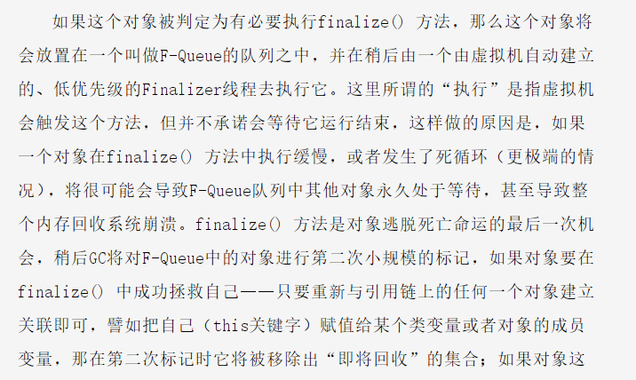
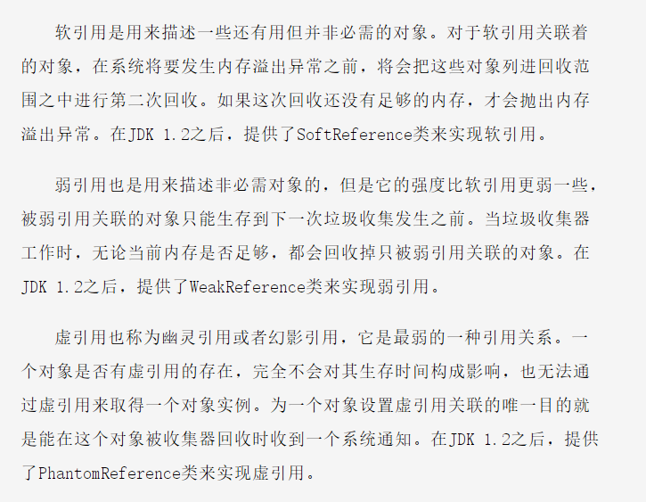

# 深入理解 Java 虚拟机读书笔记

## 第二章  Java 内存区域与内存溢出异常

### 运行时数据区

#### 程序计数器

当前线程所执行的字节码的 **行号指示器**

每条线程都需要有一个独立的 程序计数器，各条线程之间计数器互不影响，属于**线程私有区域**

* 如果执行的是一个 Java 方法，计数器记录的是正在执行的虚拟机字节码指令的地址

* 如果执行的是一个 Native 方法，计数器的值则为空（undefined）

#### Java 虚拟机栈

也是属于**线程私有区域**，生命周期与线程相同。

每个 Java 方法在执行的同时都会创建一个栈帧用于存储局部变量、操作数栈、方法出口等信息，每一个方法从调用直至执行完成的过程，就对应着一个栈帧在虚拟机栈中入栈到出栈的过程。

局部变量表所需的内存空间在编译期间完成分配，当进入一个方法时，这个方法需要在帧中分配多大的局部变量空间是完全确定的，在方法运行期间不会改变局部变量表的大小。

该区域有两种异常情况

* `StackOverflowError` ：线程请求的栈深度大于虚拟机所允许的深度 
* `OutOfMemoryError` ：虚拟机在自动扩展的时候请求不到足够的内存

#### 本地方法栈

与虚拟机栈发挥的作用类似，但是两者服务对象不同，本地方法栈为虚拟机使用到的 Native 方法服务，虚拟机栈为虚拟机执行的 Java 方法服务。

备注：有的虚拟机实现可以把二者合二为一

与虚拟机栈一样，该区域也存在两种异常情况，同上。

#### Java 堆

Heap 是 虚拟机所管理内存中最大的一块，此区域是被所有线程共享的一块内存区域，在虚拟机启动时创建。

此区域的唯一目的就是 **存放对象实例**，几乎所有的对象都在这里分配内存。

#### 方法区

此区域是线程共享的，用于存储已被虚拟机加载的类信息、常量、静态变量等代码数据。

当方法区无法满足内存分配需求时，抛出 `OutOfMemoryError`异常。

##### 运行时常量池

方法区的一部分

### HotSpot 虚拟机对象探秘

#### 对象的创建

* 指针碰撞

* 空闲列表

#### 对象的内存布局

对象在内存中存储的布局可以分为 3 块区域：**对象头、实例数据和对齐填充**

## 第三章 垃圾收集器与内存分配策略

### 概述

说起垃圾回收我们需要思考三个问题：

* 哪些内存需要回收 ？
* 什么时候回收 ？
* 怎么回收 ？

如何判断对象是否存活？

#### 引用计数算法

为每个对象设置一个引用计数器，每当有一个地方引用该对象时，计数器值加 1 ，引用失效时，计数器值减 1，当计数器值变成 0 的时候就代表这个对象是不可能再被使用的，此时就代表该对象可以回收。

这种算法实现简单，效率也很高，但是同时也会存在一个问题，那就是当两个对象相互循环引用的时候，哪怕这两个对象以后再也不会用到，但是因为相互引用的问题，这两个对象的引用计数器始终不为 0，导致 GC 无法回收他们。

也正是因为这个问题，所以很多主流虚拟机厂商都没有选择这种回收计数算法。而更多的使用的是下文将要介绍的**可达性分析算法**。

#### 可达性分析算法

该算法的原理是：以 `GC Roots` 的对象作为起始点，然后以该节点为基准开始向下搜索，搜索过程中搜索路径我们称之为**引用链**，当一个对象到 `GC Roots` 没有任何引用链连接的时候，说明该对象是不可用的。

注意：可以作为 `GC Roots` 对象的包括以下几种

* 虚拟机栈（本地变量表）中引用的对象
* 方法区中类静态属性引用的对象
* 方法区中常量引用的对象
* 本地方法栈中 JNI （Native 方法）引用的对象

我们需要注意一点，哪就是即使通过可达性分析中不可达的对象也不是必须要回收的。

一个对象在真正被回收之前，需要经历两次标记过程：

>如果对象在进行可达性分析之后发现没有与 GC Roots 相连接的引用链，那它将会被第一次标记并且进行一次筛选，筛选的条件是此对象是否有必要执行 finalize() 方法，当对象没有覆盖 finalize() 方法 或者 finalize() 方法已经被虚拟机调用过，这两种情况下虚拟机都认为此时没有必要执行垃圾回收。
>
>
>
>个时候还没有逃脱，哪基本上它就真的被回收了。

##### 四种引用方式

根据引用强度（从上至下依次减弱）可依次划分为：

* 强引用 `Strong Reference`

* 软引用 `Weak Reference`

* 弱引用 `Phantom Reference`

* 虚引用 `Soft Reference`

