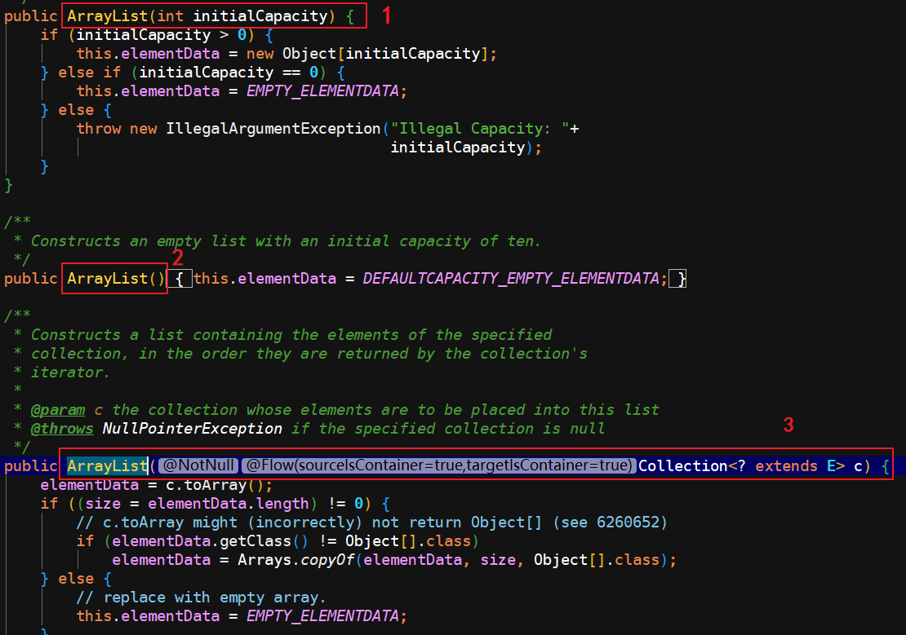
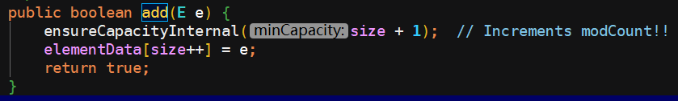
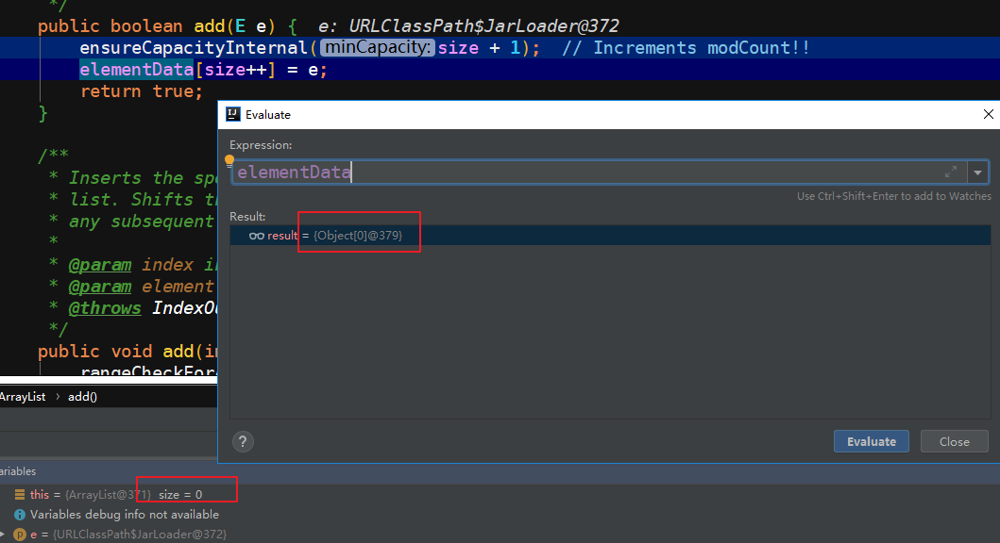
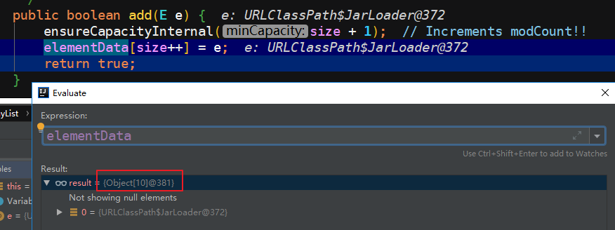
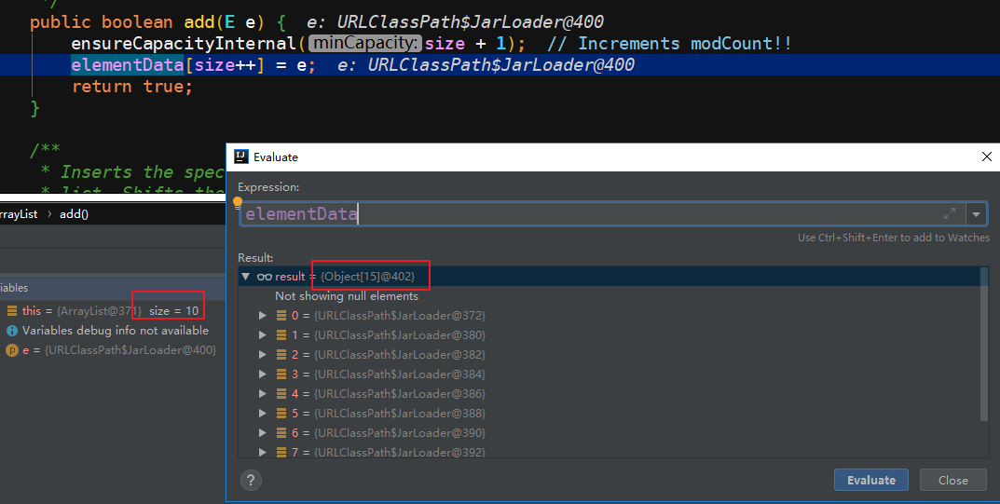
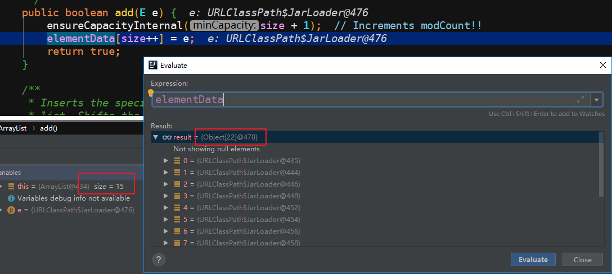

> 本文所使用的 JDK 版本：1.8.0_144

ArrayList 是一个 Java 集合，它的底层数据结构实际上就是一个数组，只不过这个数组长度不固定，动态可变，其中数组元素的类型是 Object 类型的，可以说对 ArrayList 的所有操作底层都是基于数组的。

除了上边这句话，可能很多小伙伴们还都知道：

* ArrayList 可以自动扩容;
* 线程不安全;
* 可以通过下标进行快速访问;
* 实现了 Serializable 接口，因此它支持序列化，能够通过序列化传输；

等等，因为这些东西不但在面试中很常见，就是大学课本上也清楚明白的写了，可是我们除了记住这些名词介绍之外，有没有去了解过为什么 [ArrayList 可以自动扩容?]，或者是为什么[ArrayList 线程不安全？] 等这些问题深层次的原因是什么。

限于篇幅，本篇先讨论其中一点：**ArrayList 动态扩容的底层实现原理**。

此时，大家稍安勿躁，我们需要先翻一翻 ArrayList 的源码。

### 初始化

通过查看源码，发现有以下三个构造方法：



* 用指定的大小来初始化内部数组

  ```java
  public ArrayList(int initialCapacity) 
  ```

* 默认构造器，以默认大小来初始化内部数组

  ```java
  public ArrayList()
  ```

* 接收一个 Collection 对象，并将该集合的元素添加到 ArrayList 中

  ```java
  public ArrayList(Collection<? extends E> c)
  ```

### 动态扩容

以无参构造器为例，ArrayList 内部数组初始长度为 0，源码如下：



其中，方法 `ensureCapacityInternal(size + 1)`是为了保证内部容量，通过判断，当内部容量不足时则进行扩容操作；

这里有两个点需要注意以下：

* 方法 `ensureCapacityInternal()` 的参数 size 表示的是在执行添加元素之前的数组元素个数，而不是 ArrayList 的具体容量；
* ArrayList 的容量本质上是 elementData 数组的长度；

#### 确保内部容量

先判断是否需要扩容：

```java
private static final int DEFAULT_CAPACITY = 10;
private static final Object[] DEFAULTCAPACITY_EMPTY_ELEMENTDATA = {};

private void ensureCapacityInternal(int minCapacity) {
    // 如果 elementData 数组是一个空数组的话，最小需要容量就是默认容量
    if (elementData == DEFAULTCAPACITY_EMPTY_ELEMENTDATA) {
        minCapacity = Math.max(DEFAULT_CAPACITY, minCapacity);
    }
	
    ensureExplicitCapacity(minCapacity);
}

private void ensureExplicitCapacity(int minCapacity) {
    modCount++;
	// 如果elementData 数组的长度小于最小需要的容量（minCapacity）,则进行扩容
    // overflow-conscious code
    if (minCapacity - elementData.length > 0)
        // 扩容方法
        grow(minCapacity);
}
```

简而言之，当传入的最小需要容量（也就是数组中的实际元素个数加 1 ）大于等于数组容量的时候，就需要进行扩容。

#### 扩容

紧接着我们继续看它是到底是如何扩容的，具体扩容方式参见源码注释：

```java
/**
     * The maximum size of array to allocate.
     * Some VMs reserve some header words in an array.
     * Attempts to allocate larger arrays may result in
     * OutOfMemoryError: Requested array size exceeds VM limit
     */
private static final int MAX_ARRAY_SIZE = Integer.MAX_VALUE - 8;

private void grow(int minCapacity) {
    // overflow-conscious code
    int oldCapacity = elementData.length;
    // 位运算，向右移动一位 (位运算右移意味着做除法，但是位运算效率更高)
    // 用除法表示就相当于 newCapacity = oldCapacity + 0.5 * oldCapacity
    // 也就是说 ArrayList 的扩容是每次 1.5 倍数扩容的
    int newCapacity = oldCapacity + (oldCapacity >> 1);
    if (newCapacity - minCapacity < 0)
        // newCapacity 取 minCapacity 和 newCapacity 之间较大的一个值
        newCapacity = minCapacity;
    if (newCapacity - MAX_ARRAY_SIZE > 0)
        // 此处对 MAX_ARRAY_SIZE 的值是 Integer.MAX_VALUE - 8
        // 根据注释来看 是说 当数组长度超过 Integer.MAX_VALUE - 8 这个值之后有可能会发生 OutOfMemoryError 异常，但是为啥偏偏减了 8 这个值，尚待研究！
        newCapacity = hugeCapacity(minCapacity);
    // 元素复制 
    // minCapacity is usually close to size, so this is a win:
    elementData = Arrays.copyOf(elementData, newCapacity);
}
```

#### 添加元素

当上述容量判断结束之后，真正开始添加元素到 elementData 数组中，就是 `add(E e)` 方法中的 `elementData [size++] = e;`这行代码。

另外可以得到一点，就是 ArrayList 在使用默认构造方法初始化的时候，会**延迟分配对象数组空间**，只有在第一次插入元素的时候才会去分配数组空间（默认空间大小是 `DEFAULT_CAPACITY = 10`）。

### 用代码说话

我们模拟往 ArrayList 中添加 20 个数据，根据以上我们对 ArrayList 源码的分析可以得出 ArrayList 的容量变化过程是：

* 往 ArrayList 添加第一个元素的时候，ArrayList 会初始化内部的 elementData 数组，容量使用默认容量（10）；
* 往 ArrayList 添加第 11 个元素的时候，容量不足（11 > 10）,需要扩容，通过以上分析可得是按照 1.5 倍进行扩容的，也就是说此时会扩容到 10 + 10 * 0.5 = 15;
* 往 ArrayList 添加第 16 个元素的时候，容量再次不足（16 > 15），需要再次扩容，此次扩容结果是 15 + 15 * 0.5 = 22;

哪么实际的扩容结果是不是和我们分析的一致呢 ？请看如下实际测试结果：


* 尚未开始添加数据的时候

  

* 往 ArrayList 添加第一个元素的时候

  

* 往 ArrayList 添加第 11 个元素的时候

  

* 往 ArrayList 添加第 16 个元素的时候

  

**综上**：我们之前的分析结果是完全 ok 的哈，如果还是不太理解的话大家可以一步一步去调试一下代码，看一下分别在第 10 、第 11、第 15、第 16 个元素添加到 ArrayList 时具体的容量变化，眼过千遍，不如手过一遍，毕竟只有自己撸到手的才算是自己的知识。

### 总结

结合本文所述，对于 ArrayList 的自动扩容原理，概括起来就是以下几点：

- ArrayList 通过无参构造的话，初始数组容量为 0 ；
- 在对数组真正开始添加元素时，才真正给数组对象分配容量（默认初始容量值是 10）；
- 容量不足时每次按照 **1.5** 倍（位运算）的比率进行扩容；

------

本篇内容比较简单，常听大佬说看源码是相当好的一种学习方式，以前不觉得，随着工作越来越长时间，发现单纯的靠 CRUD 的业务代码的确是很难提高自己的编码水平，除非项目是非常具有挑战性的（当然大多数程序员的项目说白了没啥技术难度和挑战性，比如我... ...）。哪么我们就只有通过读源码的方式来学习，来提高自己的代码水平，长路漫漫，共勉吧