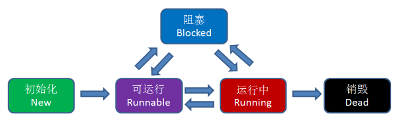

> 最近更新比较少，内心十分的愧疚，实在是太忙了！向各位读者说句抱歉。

今天要讲的这个东西说实话，我也是今天才知道，一个我们大多数人可能从来都没用过的语法，哪就是传说中的【协程 Coroutine】。

可能你会说，携程谁不知道啊，不就是哪个用来订机票订酒店的软件么，这有什么好学的！这样的话你就错了，此协程非彼携程，可不要傻傻分不清楚喽！

### 什么是进程和线程

#### 进程是什么

直白地讲，进程就是应用程序的启动实例。比如我们运行一个游戏，打开一个软件，就是开启了一个进程，进程拥有代码和打开的文件资源、数据资源、独立的内存空间。

#### 线程又是什么

线程从属于进程，是程序的实际执行者。一个进程至少包含一个主线程，也可以有更多的子线程，线程拥有自己的栈空间。

线程具有五种状态：



**对操作系统来说，线程是最小的执行单元，进程是最小的资源管理单元。**

无论进程还是线程，都是由操作系统所管理的。

#### **进程和线程的痛点**

线程之间是如何进行协作的呢？

最经典的例子就是**生产者/消费者模式**：

若干个生产者线程向队列中写入数据，若干个消费者线程从队列中消费数据。

### 什么是协程

官方定义如下：

> A coroutine is a **function** that can **suspend** its execution (yield) until the given given **YieldInstruction** finishes.

用我蹩脚的英语来翻译一下就是：

>  协程是一种可以暂停执行过程的函数，它可以中断当前的执行过程直到下一个 Yield 指令达成。
>
>  
我的理解是可以把它当成为类似 于CPU 在多个进程间切换，从而达到多个进程同时执行的效果。**协程**是一种比线程更加轻量级的存在，一个进程可以拥有多个线程，一个线程也可以拥有多个协程。

学过计算机组成原理的都知道，当 CPU 在多个进程间切换时，那些后台程序就会处于这种暂停用英文的 Suspend 或许更恰当）的状态，所以早年的电脑即使用一个 CPU 也可以同时处理多个进程任务，这是一种“伪多线程”的技术。

除此之外比较重要的一点是，协程不是被操作系统内核所管理，而完全是由程序所控制（也就是在用户态执行）。这样带来的好处就是性能得到了很大的提升，不会像线程那样需要上下文切换来消耗资源，因此**协程的开销远远小于线程的开销**。

**注意**，这里要划一个重点，**协程是一种“伪多线程”**，始终记得这一点，可以帮助我们来理解协程会这个概念。

### 协程函数的写法

**Java 语言**并没有对协程提供原生支持，所以用 Java 暂时还演示不了，但是有个开源框架基本模拟除了协程的功能，感兴趣的朋友可以去看看源码。。。

> 地址 ：https://github.com/kilim/kilim

**Go 语言**根据我查询资料来看，对于协程的支持超乎我的想象，可以说是强大而简洁，轻轻松松分分钟创建成百上千个协程并发执行。

```go
func Add(x, y int) {
    z := x + y
    fmt.Println(z)
}
 
func main() {
    for i:=0; i<10; i++ {
        go Add(i, i)
    }
}
```

如上代码，在一个函数调用前加上 go 关键字，这次调用就会在一个新的协程中并发执行。当被调用的函数返回时，这个协程也自动结束。需要注意的是，如果这个函数有返回值，那么这个返回值会被丢弃。

Python 语言也可以通过 yield/send 的方式实现协程。在 python 3.5 以后，async/await 成为了更好的替代方案。

```python
def consume():
    while True:
        # consumer 协程等待接收数据
        number = yield
        print("开始消费",number) 
        
consumer = consume()
# 让初始化状态的 consumer 协程先执行起来，在 yield 处停止
next(consumer)
for num in range(0,100)
	print("开始生产",num)
    # 发送数据给 consumer 协程
    consumer.send(num)
```

其他语言的写法我也就不写了，毕竟不太熟，写了怕误人子弟！！！

### 总结

根据今天查阅的资料来看，协程的应用场景主要在于 ：I/O 密集型任务。

这一点与多线程有些类似，但协程调用是在一个线程内进行的，是单线程，切换的开销小，因此效率上略高于多线程。当程序在执行 I/O 时操作时，CPU 是空闲的，此时可以充分利用 CPU 的时间片来处理其他任务。在单线程中，一个函数调用，一般是从函数的第一行代码开始执行，结束于 return 语句、异常或者函数执行（也可以认为是隐式地返回了 None ）。 有了协程，我们在函数的执行过程中，如果遇到了耗时的 I/O 操作，函数可以临时让出控制权，让 CPU 执行其他函数，等 I/O 操作执行完毕以后再收回控制权。

简单来讲协程的好处：

- 跨平台
- 跨体系架构
- 无需线程上下文切换的开销
- 无需原子操作锁定及同步的开销
- 方便切换控制流，简化编程模型
- 高并发+高扩展性+低成本：一个CPU支持上万的协程都不是问题。所以很适合用于高并发处理。

缺点：

- 无法利用多核资源：协程的本质是个单线程,它不能同时将 单个CPU 的多个核用上,协程需要和进程配合才能运行在多CPU上.当然我们日常所编写的绝大部分应用都没有这个必要，除非是cpu密集型应用。
- 进行阻塞（Blocking）操作（如IO时）会阻塞掉整个程序：这一点和事件驱动一样，可以使用异步IO操作来解决

最后再贴个图来总结一下，更清楚：


