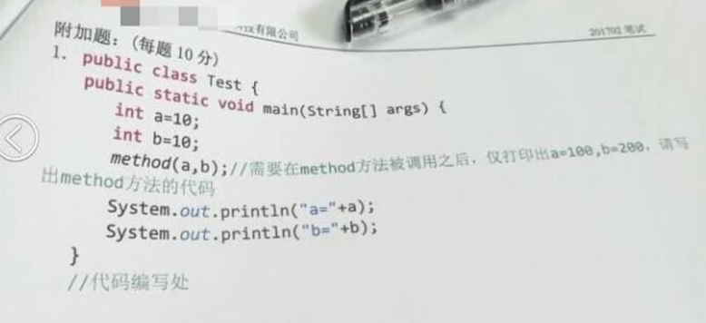
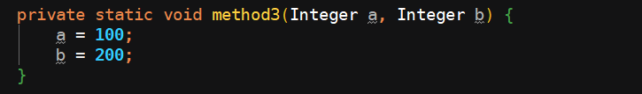
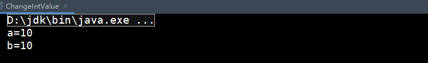
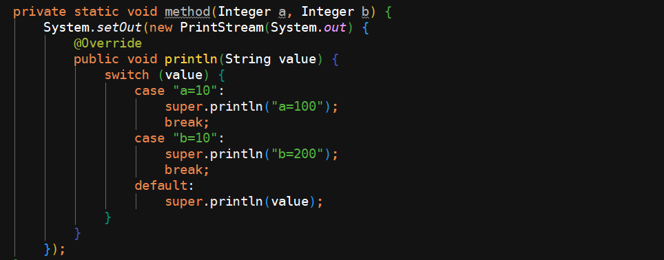
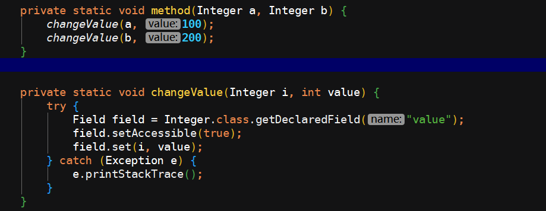

今天的题目来源于小马哥的技术交流群里一位小伙伴的发问，他发出来这样一张图，问说是不是题目有问题，哪会我刚好有时间，瞅了一眼看着确实好像有问题。

### 题目

这道题目是看着是比较诡异的，因为正常情况下 Java 有两种传递方式，其一是值传递，其二是引用传递，所以本题需要我们修改  a 和 b 变量的值，可是 int 的值怎么能被改变呢 ？你如果说这两个变量是 Interger 的，哪无话可说，很容易就可以实现这个功能，但此处是 int 。

### 我的沙雕实现

是不是简单明了

然而理想是丰满的，可是现实却会很骨感，如上代码执行结果是：

瞧见没，啥都没变！

### 群友实现

群友们提供了一种思路就是把这个打印操作由 method 方法来代替，然后在打印结束之后直接终止程序执行，简单粗暴，但是能实现功能要求，具体代码可以参考如下实现：

利用 `System.exit(0)` 来终止虚拟机的运行，`System.exit(status )`这个方法，接收一个参数 `status`，0 表示正常退出，非零参数表示非正常退出，也就是说不管 `status` 为何值都会退出程序。和 `return` 相比，`return` 是回到上一层，而 `System.exit(status)` 是回到最上层。

使用这个方法，虽然可以实现功能，但是不科学，因为好端端的我们不能去人为中止虚拟机的执行，可是了想了半天，又没有啥好的想法。

### 小马哥实现

一小会功夫之后，小马哥出来给我们秀了一波，他的实现是这样的：

看到这段代码的时候群友们的心情是这样的

突然产生了一种要退群的欲望，我不配在这个群里，这代码也太骚气了吧 ... ...

对于小马哥这等大牛，我只能是膜拜了，此处也帮小马哥做个广告，小马哥在思否讲堂有个 一入Java深似海的收费讲座，感兴趣的可以去思否讲堂看看，保证让你怀疑人生，搞不好还会劝退，要是哪天一旦被劝退了，哪么我应该恭喜你脱离码农苦海，从此走上康庄大道，迎娶白富美！

具体讲座地址在 ：http://t.cn/EGlIYaC

### 问题延伸

如果是 a 和 b 两个变量是 Integer 类型的话又该怎么做？

这个问题大家可以先思考一下，因为 Integer 是 int 的包装类，此处会好操作很多。

具体代码实现可以参考：

今天的题目到这里就结束了，你 get 到了吗？

-------------

