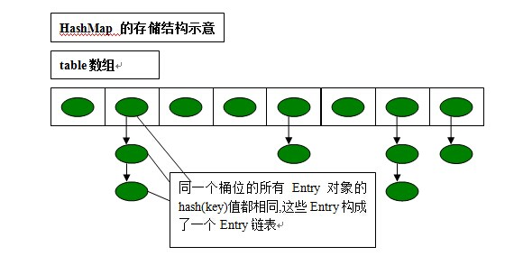
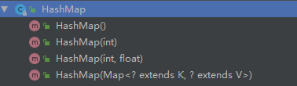
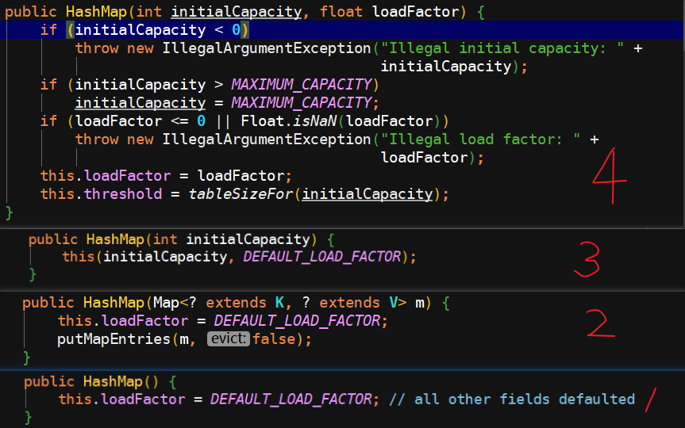
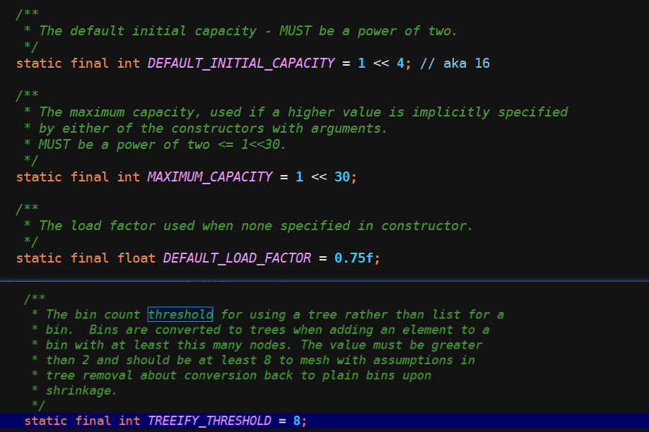
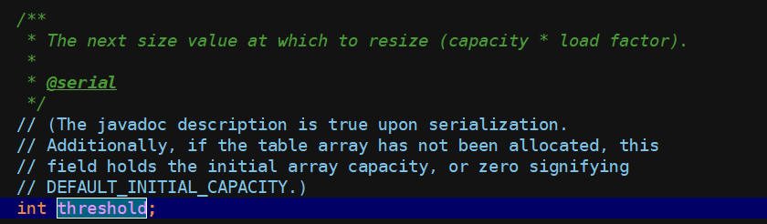
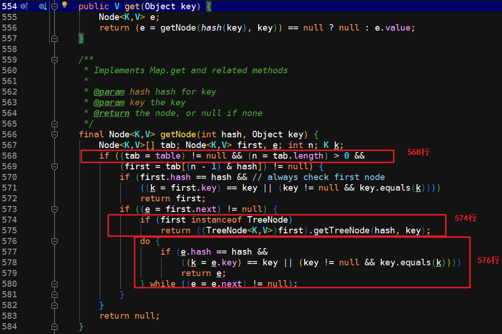
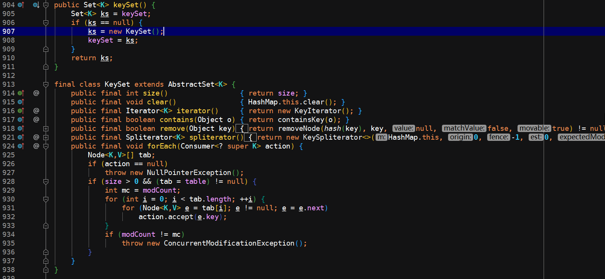
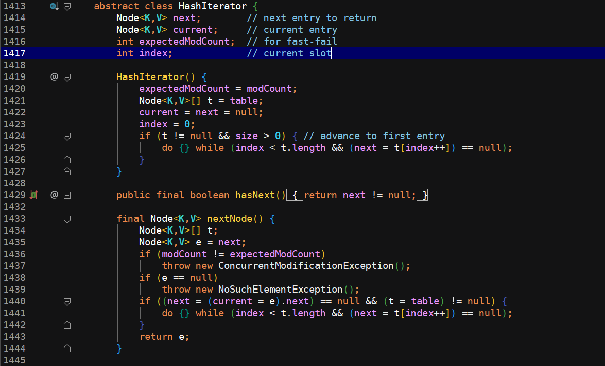
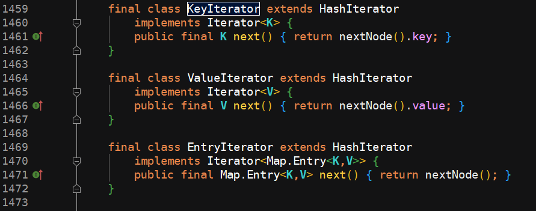
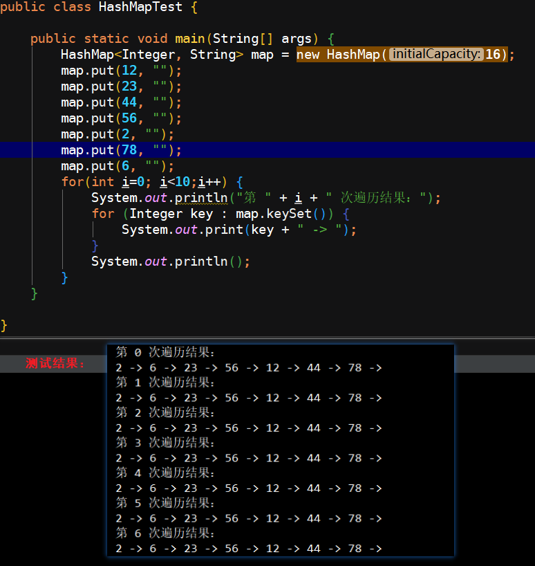

> 面试官 ：你了解 HashMap 吗？
>
> 程序员 ：呃，HashMap 允许 NULL 键 和 NULL 值，HashMap 不保证键值对顺序，非线程安全，在多线程环境下可能会存在问题。
>
> 面试官 ：哪你知道它的底层实现原理么？
>
> 程序员 ：底层是基于散列算法实现的。
>
> 面试官 ：哪什么是散列算法？HashMap 采用了哪种散列算法？JDK 1.8 对 HashMap 做了何种优化？它的数据结构是什么样的 ... ...
>
> 程序员 ：冷汗中 ... ...

上边这个过程是不是很熟悉，有没有找到点你的影子？换句话说，虽然现在 HashMap 的底层原理已经被面试官问烂了，但是还是有很多人并不清楚。今天老生常谈，重新写一下 HashMap 的底层工作原理，顺便自己也复习复习！

### 原理

HashMap 底层基于散列算法实现，散列算法又分为拉链式和散列再探测。HashMap 是采用拉链式的散列算法，并且在 JDK1.8 中引入了红黑树来优化过长的链表，提高 HashMap 的效率，它的结构可以简单理解为下图：



##### 拉链式散列算法

数据结构是由数组和链表组成，在对元素进行增删改操作时：

1. 先定位到需要操作元素的捅的位置（也就是上图 table 数组的位置）；
2. 然后在找到的捅的位置对应的链表中继续查找指定元素；
3. 如果找到则返回该元素信息，反之则返回 NULL；

##### 注意

JDK 1.8 之后引入了红黑树来优化 HashMap, 底层数据结构在链表超过一定长度之后会由 【数组 + 链表】 转变为 【数组 + 红黑树】的结构。

### 源码分析

> 环境 ：java version "1.8.0_144"

#### 构造方法



可以看出来它有四个构造方法，构造方法的左右我们都知道，是为了做初始化，我们就具体看一下它具体负责初始化了哪些东西。



以上就是这 4 个构造方法的明细内容，我们平时用的最多的可能就是第四个方法，无参构造方法。

* 无参构造方法中对 loadFactor 变量做了初始化，这个变量我们叫它【负载因子】；
* 第 4 个构造方法初始化了两个变量，其中一个是 initialCapacity，我们称作是【HashMap 初始容量】，另外还需要注意的一个值是 threshold，它代表的是【当前 HashMap 所能容纳键值对数量的最大值】，也就是说当容量超过这个值，HashMap 就需要扩容。

以上参数具体含义，请继续查看下文介绍。

#### 初始容量、负载因子、阈值

初始阈值 threshold 由 initialCapacity 经过移位运算算出，之后【阈值】的大小可以由【初始容量】和【负载因子】来影响到。

负载因子对于 HashMap 来说是一个比较重要的参数，该参数反应了 HashMap 捅数组的使用情况，通过调节负载因子，可以在具体的场景提高 HashMap 的效率：

* 调低负载因子 ：HashMap 所能容纳的键值对数量会变少，在扩容时，重新将键值对存储新的桶数组里，键和键之间会减少碰撞，链表长度也相应变短，最终造成的结果就是 HashMap 的增删改查效率会提高，这就是算法中常说的一个 拿空间换时间；
* 调高负载因子 ：HashMap 所能容纳的键值对数量变多，空间利用率高，但碰撞率也高。这意味着链表长度变长，效率也随之降低，这种情况是拿时间换空间。





默认情况下，HashMap 的初始容量大小是 16，负载因子 0.75，阈值是通过容量乘上负载因子算出，及 `thread = capacity * loadFactor`。

大家如果一步一步带着自己的思考看到这个地方的时候，其实应该发现三个问题：

* HashMap 中并没有定义 initialCapacity 这个变量，原因是什么？

* 构造方法中并没有初始化我们文章开头所分析到的存储键值对的数据结构，哪我们传进去这个所谓的初始容量值有什么用？

* 阈值的算法是容量乘上负载因子，但是在构造方法 4 中初始化 threshold 的值的时候并没有利用这个算法，而是使用了如下算法：

  

P.S : 带着问题去思考往往能得到意向不到的结果，所以，接下来的内容大家要记得这三个问题，然后慢慢深入理解。

#### 查找



查找方法的核心在于 getNode() 方法，简单来讲，HashMap 的查找操作比较简单：

1. 定位键值所在的桶的位置；
2. 然后定位键值桶所在的链表和红黑树的位置。

代码如上图：

1. 568 行代码对应步骤 1，主要是用来定位键值所在的桶位置；
2. 574 行代码是判断应该用链表查找方法还是红黑树查找方法；
3. 576 行代码是用链表查找方法，对应上述步骤 2。

接下来详细分析下 getNode() 方法中【定位键值所在的桶的位置】的逻辑：

```java
first = tab[(n-1) & hash];
```

通过以上代码可得，也就是说通过 `(n-1) & hash` 即可算出键值在桶数组中的位置，因为 HashMap 中桶数组的大小总是 2 的 N 次幂，所以 `(n-1) & hash` 就是对数组 length 取余，学过计算机组成原理的都知道，取余运算的效率是没有位运算高的，所以就选择了 `&` 运算。

接下来遍历红黑树或者遍历链表的代码我就不再赘述了，比较简单，属于常规数据结构范畴，大家可以自行了解。

查找元素结束了，接下来我们学习一下 HashMap 是如何遍历的？

#### 遍历

这部分代码较多，如下图：







可以看到，遍历时我们首选要获取键集合 KeySet 对象，然后通过 KeySet 的迭代器 KeyIterator 进行遍历，KeyIterator 继承自 HashIterator 类。

HashIterator 类的逻辑也不是很难，在初始化也就是构造方法中它先从桶数组中找到包含了链表节点引用的桶，然后对这个桶指向的链表进行遍历，遍历完成后，再继续寻找下一个包含链表节点引用的桶，然后重复这个过程，直到找不到则结束遍历。

此处就会有一个比较有意思的现象，哪就是你会发现多次对 HashMap 进行遍历时，遍历结果顺序都是一致的。但这个遍历顺序和插入的顺序不一定一致。产生上述行为的原因是怎样的呢？

其实答案就在上边贴出来的代码中，主要是 HashIterator  这一部分代码决定的，我们也可以写一段代码来测试一下这个结论。



#### 插入

插入逻辑如下：

1. 定位要插入的键值属于哪个桶；
2. 判断桶是否为空；
   * 空：直接将键值对存入；
   * 非空：需将键值对接在链表最后一个位置，或者更新键值对；

以上就是一个简易的插入流程，可能大家觉得过于简单了。当然，实际的代码要远比这复杂，因为 HashMap 是一个长度可变的集合，自然而然就要考虑扩容问题；其次 JDK 1.8 中引入了红黑树，则还需要考虑当链表长度达到多少时转化为红黑树实现等等的问题。